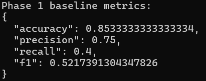

# Adversarial 5G Digital Twin (MVP)

This repository hosts a layered research framework for:

- 5G simulation and telemetry generation
- telemetry cleaning and feature extraction
- anomaly detection models
- adversarial attack emulation
- defense evaluation

The current implementation provides a runnable MVP baseline so the full structure can be developed incrementally.

## Quick Start

1. Create a Python virtual environment.
2. Install dependencies.
3. Run baseline tests.
4. Run phase 1 baseline pipeline.

Commands:

- `python -m venv .venv`
- `.venv\\Scripts\\Activate.ps1`
- `pip install -r requirements.txt`
- `pytest -q`
- `python -m experiments.runners.run_phase1_build`

## What Works Now

- Synthetic telemetry generation via mock collector
- **NS-3 telemetry ingestion** via CSV file or socket (new!)
- Cleaning, normalization, and window feature extraction
- Isolation Forest and One-Class SVM detector wrappers
- Label flipping attack utility
- Clipping and outlier defense utilities
- Phase 1 baseline runner writing metrics JSON

## Using NS-3 Telemetry

By default, the baseline uses synthetic mock telemetry. To switch to real ns-3 simulation output:

1. **Generate ns-3 telemetry CSV** (or use provided sample):
   - Sample file: `simulation/ns3/scratch/sample_telemetry_output.csv` (18 rows, includes benign + anomaly periods)
   - If ns-3 is installed locally, copy `simulation/ns3/scratch/5g_baseline.cc` into your ns-3 checkout's `scratch/` directory, then run `./ns3 run "scratch/5g_baseline"` from the ns-3 root.
   - The simulation writes `scratch/5g_baseline_telemetry.csv` by default; copy that file back into this repo or update `config.yaml` to point at it.
   - For proof, also keep `scratch/5g_baseline_telemetry.provenance.json` and generate `scratch/5g_baseline_telemetry.proof.json` with `tools/verify_ns3_telemetry.py`.

2. **Edit `config.yaml`**:
   ```yaml
   collector:
     type: "ns3_file"  # Change from "mock" to "ns3_file"
     ns3_log_file: "simulation/ns3/scratch/sample_telemetry_output.csv"
   ```

3. **Run baseline with ns-3 data**:
   ```
   python -m experiments.runners.run_phase1_build
   ```

**Expected NS-3 CSV Format**:
```
timestamp,ue_id,rsrp,latency,throughput,label
0.1,1,-80.5,25.3,45.2,0
0.2,1,-80.2,25.1,45.5,0
...
```

**Collector Classes**:
- `MockCollector`: Generates synthetic data (default, no dependencies)
- `NS3Collector`: Reads from CSV file exported by ns-3
- `NS3SocketCollector`: Live ingestion from ns-3 TCP socket (experimental)

**Evidence you can attach for a real ns-3 run**:
- `scratch/5g_baseline_telemetry.csv`
- `scratch/5g_baseline_telemetry.provenance.json`
- `scratch/5g_baseline_telemetry.proof.json`
- a terminal screenshot of the phase 1 metrics output
- note that the run was performed in Ubuntu (WSL Ubuntu)
- terminal output showing `Telemetry written to ...` and `Provenance written to ...`



## Next Build Steps

- Expand ns-3 simulation with mobility and more realistic attack scenarios
- Add phase 2 runner: automated attack experiments (label flipping, poisoning, injection)
- Add phase 3 runner: measure attack perturbation thresholds
- Add phase 4 runner: defense stacking and cost tradeoff analysis
- Add richer model benchmarking, plotting, and statistical validation
- Populate Jupyter notebooks for interactive exploration and reproducibility
- Generate paper figures and artifacts